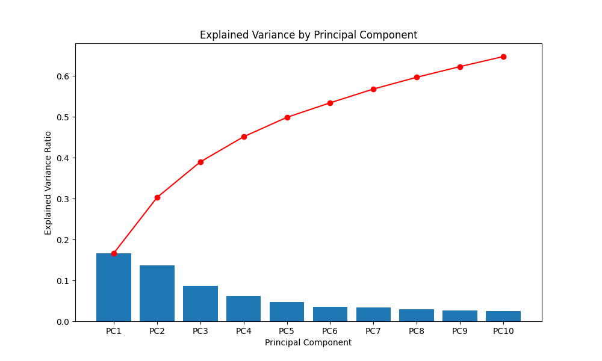
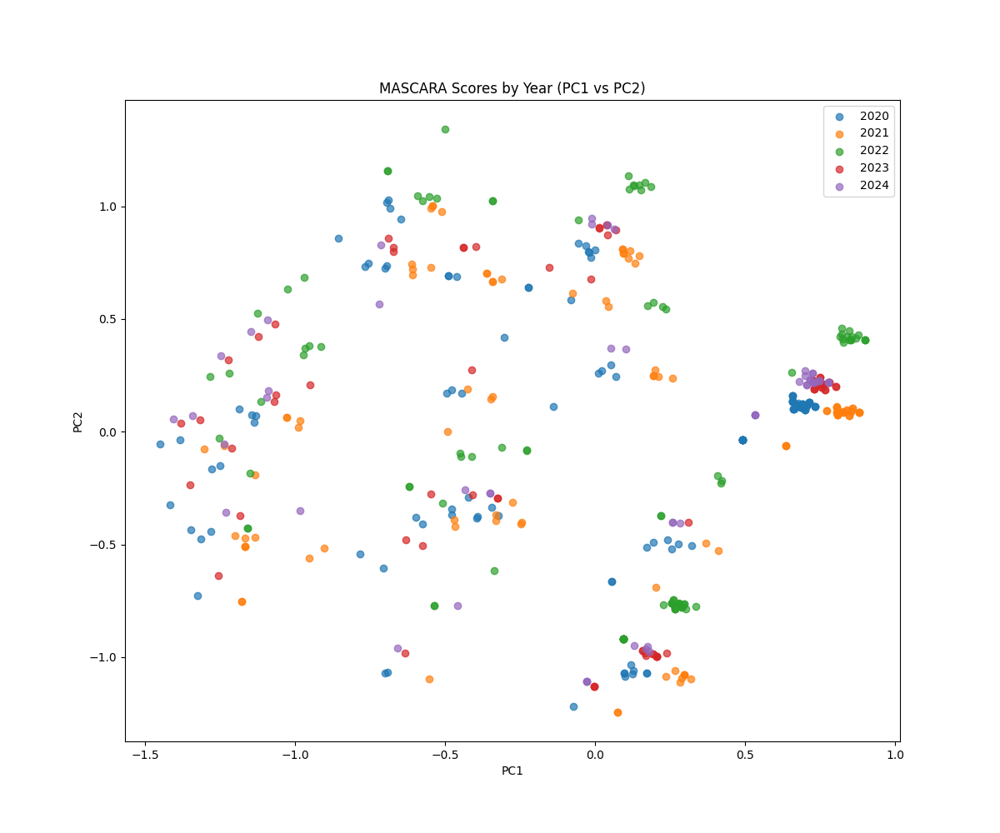
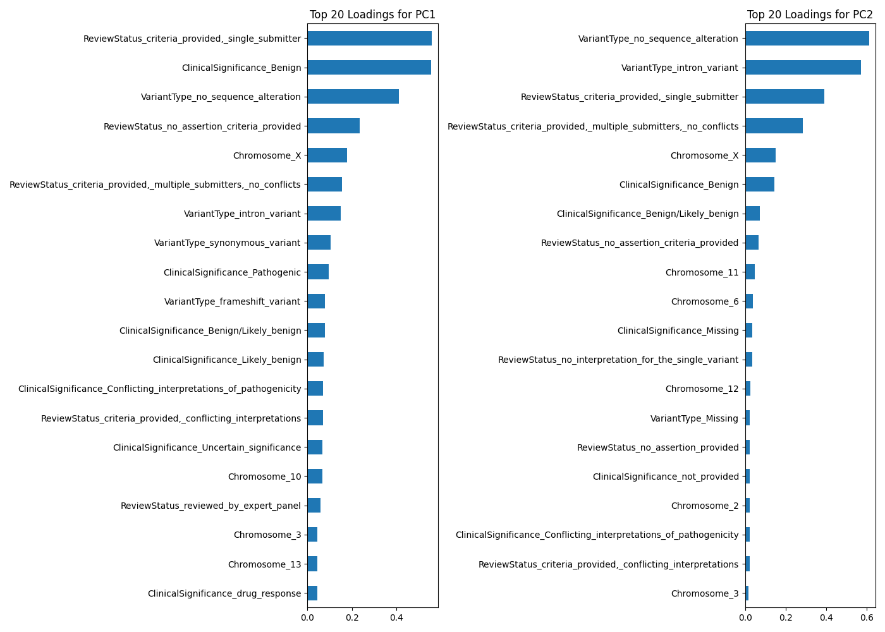

# ClinVar: Tracking Variant Re-classification

Primary objective: To compare different temporal snapshots of the dataset (e.g., a recent vs. an older release) to identify, characterize, and understand the patterns behind variant re-classifications over time.

## Project Stages & Goals

### Stage 1: Data Ingestion & Processing Pipeline [x]
-   **Objective:** Establish a stable and memory-efficient pipeline to process large ClinVar VCF releases into a structured Apache Parquet format.
-   **Key Challenge & Resolution:** Initial attempt to parse ClinVar XML release failed due to insurmountable memory (OOM) errors on a 60 GB RAM instance. Had to pivot to using standard VCF format and `cyvcf2` library.

### Stage 2: Longitudinal Analysis [ ]
-   **Objective:** Compare both processed datasets ( 2025 release vs. 2024 release) to identify re-classified variants.
-   **Core Tasks:**
    1.  Identify set of variants that are present in both datasets
    2.  Pinpoint variants where `ClinicalSignificance` or `ReviewStatus` has changed between 2x points
    3.  Quantify and categorize re-classifications (e.g., count the number of VUS → Pathogenic, VUS → Benign,...,count_{-1})

### Stage 3: Pattern Discovery & Modeling [ ]
-   **Objective:** Analyze set of re-classified to find associated patterns
-   **is the re-classification linked to x gene(s), `VariantType`, `ReviewStatus`...?**

---

-   **Data Format:** ClinVar VCF (`.vcf.gz`) for GRCh38
-   **Version, file extensions and packages:**
    -   **Language:** Python 3.10+
    -   **Parsing:** `cyvcf2`
    -   **Data Manipulation:** `pandas`
    -   **Storage Format:** Apache Parquet
    -   **Analysis:** `scikit-learn`, `pandas`

---
### 2. Download Datasets
Download ClinVar VCF data for multiple timestamps

**Datasets are comprised of:** 

- .vcf.gz = main data
- .vcf.gz.tbi = index for fast access

-   **Latest Version (2025):**
-   Linux:
    ```bash 
    wget -O clinvar_latest.vcf.gz [https://ftp.ncbi.nlm.nih.gov/pub/clinvar/vcf_GRCh38/clinvar.vcf.gz](https://ftp.ncbi.nlm.nih.gov/pub/clinvar/vcf_GRCh38/clinvar.vcf.gz)
    wget -O clinvar_latest.vcf.gz.tbi [https://ftp.ncbi.nlm.nih.gov/pub/clinvar/vcf_GRCh38/clinvar.vcf.gz.tbi](https://ftp.ncbi.nlm.nih.gov/pub/clinvar/vcf_GRCh38/clinvar.vcf.gz.tbi)
    ```
    Otherwise:

      ```bash
    curl -o clinvar_2025-01-06.vcf.gz https://ftp.ncbi.nlm.nih.gov/pub/clinvar/vcf_GRCh38/archive_2.0/2025/clinvar_20250601.vcf.gz
    curl -o clinvar_2025-01-06.vcf.gz.tbi https://ftp.ncbi.nlm.nih.gov/pub/clinvar/vcf_GRCh38/archive_2.0/2025/clinvar_20250601.vcf.gz.tbi
    ```  
-   **Version 2024:**
    ```bash
    curl -o clinvar_2024-01-07.vcf.gz https://ftp.ncbi.nlm.nih.gov/pub/clinvar/vcf_GRCh38/archive_2.0/2024/clinvar_20240107.vcf.gz
    curl -o clinvar_2024-01-07.vcf.gz.tbi https://ftp.ncbi.nlm.nih.gov/pub/clinvar/vcf_GRCh38/archive_2.0/2024/clinvar_20240107.vcf.gz.tbi
    ```
-   **Version 2023:**
    ```bash
    curl -o clinvar_2023-01-07.vcf.gz https://ftp.ncbi.nlm.nih.gov/pub/clinvar/vcf_GRCh38/archive_2.0/2023/clinvar_20230107.vcf.gz
    curl -o clinvar_2023-01-07.vcf.gz.tbi https://ftp.ncbi.nlm.nih.gov/pub/clinvar/vcf_GRCh38/archive_2.0/2023/clinvar_20230107.vcf.gz.tbi
    ```   
-   **Version 2022:**
    ```bash
    curl -o clinvar_2022-01-09.vcf.gz https://ftp.ncbi.nlm.nih.gov/pub/clinvar/vcf_GRCh38/archive_2.0/2022/clinvar_20220109.vcf.gz
    curl -o clinvar_2022-01-09.vcf.gz.tbi https://ftp.ncbi.nlm.nih.gov/pub/clinvar/vcf_GRCh38/archive_2.0/2022/clinvar_20220109.vcf.gz.tbi
    ```   
-   **Version 2021:**
    ```bash
    curl -o clinvar_2021-01-10.vcf.gz https://ftp.ncbi.nlm.nih.gov/pub/clinvar/vcf_GRCh38/archive_2.0/2021/clinvar_20210110.vcf.gz
    curl -o clinvar_2021-01-10.vcf.gz.tbi https://ftp.ncbi.nlm.nih.gov/pub/clinvar/vcf_GRCh38/archive_2.0/2021/clinvar_20210110.vcf.gz.tbi
    ```   

-   **Version 2020:**
    ```bash
    curl -o clinvar_2020-01-06.vcf.gz https://ftp.ncbi.nlm.nih.gov/pub/clinvar/vcf_GRCh38/archive_2.0/2020/clinvar_20200106.vcf.gz
    curl -o clinvar_2020-01-06.vcf.gz.tbi https://ftp.ncbi.nlm.nih.gov/pub/clinvar/vcf_GRCh38/archive_2.0/2020/clinvar_20200106.vcf.gz.tbi
    ```
```bash
# To process data into multiple .parquet chunks
python 1_parse_vcf_cyvcf2.py clinvar_<dataset_name>.vcf.gz clinvar_<dataset_name>_parquet/

```bash
python 1_parse_vcf_cyvcf2.py data/raw/datasets/2024/clinvar_2024-01-07.vcf.gz clinvar_2024_parquet/
python 1_parse_vcf_cyvcf2.py data/raw/datasets/2023/clinvar_2023-01-07.vcf.gz clinvar_2023_parquet/
python 1_parse_vcf_cyvcf2.py data/raw/datasets/2022/clinvar_2022-01-09.vcf.gz clinvar_2022_parquet/
python 1_parse_vcf_cyvcf2.py data/raw/datasets/2021/clinvar_2021-01-10.vcf.gz clinvar_2021_parquet/
python 1_parse_vcf_cyvcf2.py data/raw/datasets/2020/clinvar_2020-01-06.vcf.gz clinvar_2020_parquet/
```

After dividing the data, run the MASCARA model:
```bash
python mascara_model.py
```
PCA alone, despite being used for continuous variables, was used on the latest dataset (with categorical features). The output was, as expected, not very interpretable (see `results/pca_latest`, the results are not worth even looking at). I then switched to using MCA, which is a dimensionality reduction technique for categorical data. AFter MCA, I applied LDA to the resulting principal coordinates to attempt to discern any pattern among the classification labels for the year:

<p align="center">
  
</p>

Note: the above results only apply to the latest dataset. I then moved on to implementing MASCARA, which is a two-stage process that involves decomposing the data according to the experimental design using ANOVA-Simultaneous Component Analysis (ASCA) and then applying PCA to the residuals from the first stage: 

<p align="center">
  
  
  
</p>

*** TEST 1: Tracking Variant Reclassification Dynamics (2020-2025)***

A master table was created by parsing over the yearly clinvar files and aggregating them into a single DataFrame. It is indexed by the unique variant identifier and contains all relevant features. The DataFrame is saved to `results/reclassification/master_longitudinal_table.parquet`.

Fot test 1, the master DataFrame was built using only 2020 (base) and 2025 (latest) data.  `4_reclassification_tracker.py` was ran on a RTX6000 Ada, 28 CPUs, 128GB RAM and 48 VRAM instance. Also, the UMAP coordinated from `3_mascara_umap.py` (this is not the right way) were used to plot the reclassification results in `5_UMAP_plot.py`:

Table with variant reclassified 2020 vs. 2025 (only a few are shown):

<div style="border: 1px solid black; padding: 10px;">

| Variant    | Clinical Significance (2020) | Review Status (2020)          | Gene (2020) | Variant Type (2020) | Clinical Significance (2025) | Review Status (2025)             | Gene (2025) | Variant Type (2025) |
|:-----------|:-----------------------------|:------------------------------|:------------|:--------------------|:-----------------------------|:---------------------------------|:------------|:--------------------|
| 1_930348_G | Likely_benign                | criteria_provided_single_submitter | SAMD11      | missense_variant    | Likely_benign                | criteria_provided_multiple_submitters_no_conflicts | SAMD11      | missense_variant    |
| 1_930388_GCCTCCCAGGAGCGTGACCGGTCCCAGCCATGAGCCCC | Benign                       | criteria_provided_single_submitter | SAMD11      | splice_donor_variant | Benign                       | criteria_provided_single_submitter | SAMD11      | splice_donor_variant |
| 1_934101_G | Benign                       | criteria_provided_single_submitter | SAMD11      | missense_variant    | Benign                       | criteria_provided_single_submitter | SAMD11      | missense_variant    |
| 1_934103_G | Benign                       | criteria_provided_single_submitter | SAMD11      | missense_variant    | Uncertain_significance       | criteria_provided_single_submitter | SAMD11      | missense_variant    |
| 1_945584_C | Benign                       | criteria_provided_single_submitter | NOC2L       | synonymous_variant  | Benign                       | criteria_provided_single_submitter | NOC2L       | synonymous_variant  |
| 1_953039_G | Benign                       | criteria_provided_single_submitter | NOC2L       | synonymous_variant  | Benign                       | criteria_provided_single_submitter | NOC2L       | synonymous_variant  |
| 1_953059_A | Benign                       | criteria_provided_single_submitter | NOC2L       | intron_variant      | Benign                       | criteria_provided_single_submitter | NOC2L       | intron_variant      |
| 1_954070_C | Benign                       | criteria_provided_single_submitter | NOC2L       | synonymous_variant  | Benign                       | criteria_provided_single_submitter | NOC2L       | synonymous_variant  |
| 1_955013_G | Likely_benign                | criteria_provided_single_submitter | NOC2L       | missense_variant    | Likely_benign                | criteria_provided_single_submitter | NOC2L       | 

</div>

<p align="center">
  
  
</p>

Density Plot: ***Uniform Manifold Approximation and Projection (UMAP)*** is a dimensionality reduction technique that is used to visualize high-dimensional data in a lower-dimensional space. It is a non-linear technique that is able to preserve the local structure of the data, meaning that points that are close to each other in the high-dimensional space will also be close to each other in the lower-dimensional space.
Yellowish gradient indicates variants clustered in that UMAP space. Sort of like a hotspot where variants with similar characteristics are grouped together (similar features, which ones?👀). The contour lines connect points of equal density. The closer the contour lines, the steeper the density gradient meaning that the rate of change of density is higher in that area. See ([Topolgical Geometry](https://en.wikipedia.org/wiki/Topological_geometry)) and [UMAP](https://en.wikipedia.org/wiki/Nonlinear_dimensionality_reduction#Uniform_manifold_approximation_and_projection) for interesting reads.

Next step for TEST 1 is to explore the density regions and look at a handful of variants, see the type of features they may have in common

*** Detect and Categorize Reclassification Events ***


